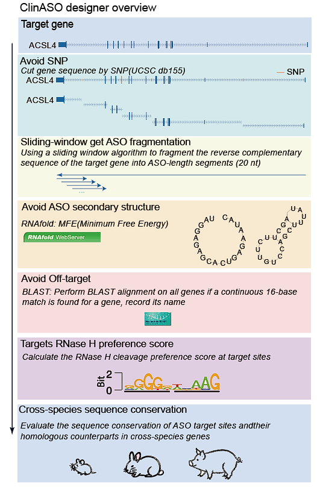

# ClinASO

**ClinASO** — A comprehensive web platform for Gapmer Antisense Oligonucleotide (ASO) design and analysis. Developed by the Bioinformatics team at [Yunnan University](https://www.ynu.edu.cn).

**Live Demo:** [www.gapmerasodesign.com](https://www.gapmerasodesign.com)



---

## Features

- 🧬 **Gapmer ASO Design** — Design gapmer ASOs with customizable parameters (length, GC content, count, selection priority) across multiple species
- 🔗 **Homology Analysis** — Evaluate ASO compatibility across 6 species (Human, Mouse, Rat, Pig, Crab-eating Macaque, Rabbit, Guinea Pig) using RNAhybrid
- 🧪 **SNP Analysis** — Investigate SNP variants within ASO target regions using dbSNP v157
- 🎯 **Off-Target Analysis** — Predict potential off-target binding sites across the human genome (GRCh38)

---

## Architecture

```
ClinASO/
├── web/
│   ├── app/              # Flask backend (app.py) + frontend files
│   │   ├── app.py        # Main Flask application
│   │   ├── index.html    # Frontend HTML
│   │   ├── script.js     # Frontend JavaScript
│   │   └── style.css     # Frontend styles
│   └── static/           # Images and static assets
├── asodesigner/          # Core ASO design pipeline
│   ├── aso_design2.sh    # Main design pipeline script
│   ├── scr/              # Python scripts for each design step
│   ├── scr_b/            # Backup scripts
│   └── text/             # Species mapping & PWM data
├── homology/             # Cross-species homology analysis
│   ├── _homologyanalysis.sh
│   ├── appdesignASO.py   # Extract ortholog gene sequences
│   └── homology_report.py # PDF report generator
├── snp/                  # SNP analysis module
│   ├── _snp.sh
│   └── plot.py           # PDF report with SNP visualization
├── offtarget/            # Off-target analysis module
│   ├── _offtarget.sh
│   └── _plot.py          # PDF report generator
├── config/
│   └── genetic-analysis.service.example  # Systemd service config
└── docs/                 # Additional documentation
```

---

## System Requirements

| Component | Minimum Version |
|-----------|----------------|
| OS | Ubuntu 20.04+ / CentOS 7+ |
| Python | 3.8+ |
| Conda | Miniconda3 or Anaconda3 |
| Web Server | Nginx |
| Node.js | Not required |

---

## Installation

### 1. Clone the Repository

```bash
git clone https://github.com/wusuw/ClinASO.git
cd ClinASO
```

### 2. Create Conda Environment

```bash
# Create the main environment
conda create -n clinaso python=3.10 -y
conda activate clinaso

# Install Python dependencies
pip install flask flask-cors reportlab pillow biopython
```

### 3. Create RNAhybrid Environment

```bash
conda create -n RNAhybrid -c bioconda rnahybrid -y
```

### 4. Install System Dependencies

```bash
# Ubuntu/Debian
sudo apt update
sudo apt install -y nginx bedtools bcftools

# CentOS/RHEL
sudo yum install -y nginx bedtools bcftools
```

### 5. Download Genomic Reference Files

Genomic reference files are too large to include in this repository. You need to download them separately:

#### Human Genome (GRCh38)
- Download from [NCBI](https://ftp.ncbi.nlm.nih.gov/genomes/all/GCF/000/001/405/GCF_000001405.40_GRCh38.p14/)
- Required files: `genomic.fna`, `genomic.gtf`
- Place in: `asodesigner/reference/human/`

#### Mouse Genome (GRCm39)
- Download from [NCBI](https://ftp.ncbi.nlm.nih.gov/genomes/all/GCF/000/001/635/GCF_000001635.27_GRCm39/)
- Required files: `GRCm39_genomic.fna`, `GRCm39_genomic.gtf`
- Place in: `asodesigner/reference/mouse/`

#### Rat Genome (GRCr8)
- Download from [NCBI](https://ftp.ncbi.nlm.nih.gov/genomes/all/GCF/000/001/895/GCF_000001895.6_GRCr8/)
- Required files: `GRCr8_genomic.fna`, `GRCr8_genomic.gtf`
- Place in: `asodesigner/reference/rat/`

#### Pig Genome (Sscrofa11.1)
- Download from [NCBI](https://ftp.ncbi.nlm.nih.gov/genomes/all/GCF/000/003/025/GCF_000003025.6_Sscrofa11.1/)
- Required files: `GCF_000003025.6_Sscrofa11.1_genomic.fna`, `GCF_000003025.6_Sscrofa11.1_genomic.gtf`
- Place in: `asodesigner/reference/pig/`

#### Crab-eating Macaque Genome
- Download from [NCBI](https://ftp.ncbi.nlm.nih.gov/genomes/all/GCF/000/409/795/GCF_000409795.4_Mmul_10/)
- Required files: `genomic.fna`, `genomic.gtf`
- Place in: `asodesigner/reference/crab_eating_macaque/`

#### Rabbit Genome (mOryCun1.1)
- Download from [NCBI](https://ftp.ncbi.nlm.nih.gov/genomes/all/GCF/009/642/375/GCF_009642375.1_mOryCun1.1/)
- Required files: `GCF_964237555.1_mOryCun1.1_genomic.fna`, `GCF_964237555.1_mOryCun1.1_genomic.gtf`
- Place in: `asodesigner/reference/rabbit/`

#### Guinea Pig Genome (mCavPor4.1)
- Download from [NCBI](https://ftp.ncbi.nlm.nih.gov/genomes/all/GCF/034/190/915/GCF_034190915.1_mCavPor4.1/)
- Required files: `GCF_034190915.1_mCavPor4.1_genomic.fna`, `GCF_034190915.1_mCavPor4.1_genomic.gtf`
- Place in: `asodesigner/reference/guinea_pig/`

#### Gene Orthologs File
- Download from [NCBI HomoloGene](https://ftp.ncbi.nlm.nih.gov/pub/HomoloGene/current/homologene.data)
- Place in: `asodesigner/text/gene_orthologs`

#### SNP Database (dbSNP v157)
```bash
# Human SNP VCF
wget https://ftp.ncbi.nlm.nih.gov/pub/snp/latest_release/VCF/GCF_000001405.40/GCF_000001405.40.gz
wget https://ftp.ncbi.nlm.nih.gov/pub/snp/latest_release/VCF/GCF_000001405.40/GCF_000001405.40.gz.tbi
# Place in: snp/
```

#### Off-target Genome Index
```bash
# Create gene2 fasta for off-target analysis (requires bedtools)
# You need to build this from the human genome GTF + FASTA
# Place in: offtarget/GRCh38.gene2.fasta
```

The final directory structure should look like:
```
asodesigner/reference/
├── human/
│   ├── genomic.fna
│   └── genomic.gtf
├── mouse/
│   ├── GRCm39_genomic.fna
│   └── GRCm39_genomic.gtf
├── rat/
├── pig/
├── crab_eating_macaque/
├── rabbit/
└── guinea_pig/
```

### 6. Configure the Application

Edit `web/app/app.py` and update:

```python
# Email configuration (for sending results)
SMTP_SERVER = 'smtp.example.com'
SMTP_PORT = 465
SMTP_USERNAME = 'your_email@example.com'
SMTP_PASSWORD = 'your_smtp_password'
FROM_EMAIL = 'your_email@example.com'
```

### 7. Create Output Directories

```bash
sudo mkdir -p /asodesigner/outfile /homologyanalysis/outfile /snp/outfile /offtarget/outfile
sudo chmod -R 777 /asodesigner/outfile /homologyanalysis/outfile /snp/outfile /offtarget/outfile
```

### 8. Update Shell Script Paths

All shell scripts use absolute paths. If your installation directory differs from `/`, update the paths in:

- `asodesigner/aso_design2.sh`
- `homology/_homologyanalysis.sh`
- `snp/_snp.sh`
- `offtarget/_offtarget.sh`

### 9. Configure Nginx

```nginx
server {
    listen 80;
    server_name your-domain.com;

    # Frontend static files
    location / {
        root /path/to/ClinASO/web;
        index index.html;
        try_files $uri $uri/ /index.html;
    }

    # Flask API proxy
    location /submit_design /analyze_sequence /analyze_snp /analyze_offtarget /queue-status {
        proxy_pass http://127.0.0.1:5000;
        proxy_set_header Host $host;
        proxy_set_header X-Real-IP $remote_addr;
        proxy_set_header X-Forwarded-For $proxy_add_x_forwarded_for;
        proxy_read_timeout 300s;
    }

    # Static assets
    location /static/ {
        alias /path/to/ClinASO/web/static/;
        expires 30d;
    }
}
```

### 10. Start the Service

```bash
# Copy and edit the systemd service file
sudo cp config/genetic-analysis.service.example /etc/systemd/system/genetic-analysis.service

# Edit the ExecStart path in the service file to match your installation
sudo nano /etc/systemd/system/genetic-analysis.service

# Enable and start
sudo systemctl daemon-reload
sudo systemctl enable genetic-analysis
sudo systemctl start genetic-analysis

# Check status
sudo systemctl status genetic-analysis
```

---

## Usage

Access the web interface at `http://your-domain.com`:

1. **Gapmer Design** — Enter a gene symbol, select parameters, and submit. Results (ASO candidates) will be emailed as Excel attachments.
2. **Homology Analysis** — Provide an ASO sequence and select target species. A PDF report with RNAhybrid alignment results will be emailed.
3. **SNP Analysis** — Provide a gene name and ASO sequence. A PDF report with SNP variant information will be emailed.
4. **Off-Target Analysis** — Provide a target gene and ASO sequence. A PDF report with potential off-target binding sites will be emailed.

---

## Tech Stack

| Layer | Technology |
|-------|-----------|
| Frontend | HTML5, CSS3, JavaScript |
| Backend | Python 3, Flask |
| Analysis | RNAhybrid, bedtools, bcftools |
| PDF Reports | ReportLab |
| Bio Data | BioPython, NCBI datasets |
| Web Server | Nginx |
| Service Manager | systemd |

---

## Citation

If you use ClinASO in your research, please cite:

```
ClinASO: a computational-experimental platform for rapid drug discovery of gapmer antisense oligonucleotides
```

---

## License

This project is licensed under the MIT License - see the [LICENSE](LICENSE) file for details.

---

## Contact

- **Developer:** ShunKai Chen
- **Principal Investigators:** Yunkun Dang, Fan Lai
- **Email:** chenshunkai@stu.ynu.edu.cn
- **Institution:** School of Life Sciences, Yunnan University, Kunming, China

